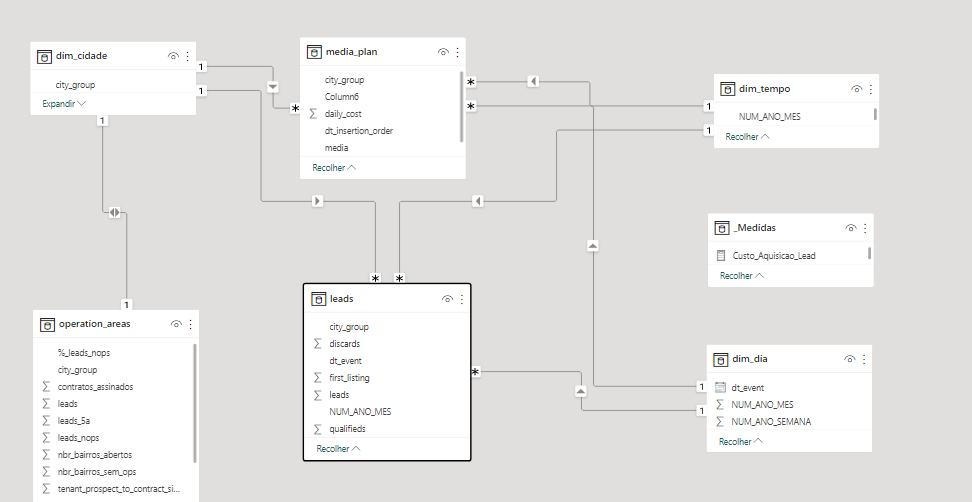

#  Plataforma Imobiliária Digital
Case buscando explorar as habilidades de análise de dados focado na dinâmica do mercado imobiliário.

## [Contexto](/in/Desafio_de_dados.pdf)

Nos últimos anos, o NonoAndar tem se firmado como a maior plataforma de moradia do Brasil, atuando nos setores de aluguel e
de compra e venda. Para possibilitar este crescimento, foram adotadas diferentes estratégias, desde a expansão das operações em novas cidades, passando pelo estabelecimento de parcerias com imobiliárias, até a definição de ações de marketing específicas para cada contexto.

### Desafio

1.	Identificar os locais em que as campanhas foram efetivas e, para aqueles em que não tivemos um resultado bom, quais podem ter sido as causas da baixa performance;
2.	Sugestões para que as novas campanhas sejam mais efetivas;
3.	Quais dados seriam relevantes para complementar a sua análise, mas não estão disponíveis? Quais análises você faria com esses dados?

## Perguntas levantadas

- Como ficou a nossa conversão do funil durante a campanha?
- Canal de Media/Investimento:
  - Qual o mix de investimento gerou o melhor retorno?
  - Como foi frequência de investimento por canal?
- Cidade:
  - Como foi a distribuição de investimento por cidade?
  - Qual teve a maior geração de leads?
  - Qual teve a melhor performance? 
    - Analisando leads e investimento por canal
  - Onde temos melhor oportundade de expansão?
  - Como devemos direcionar as próximas campanhas?

## Dados Analisados

Os dados recebidos para esse estudo e as intruções se encontram na pasta [in](/in/), caso você tennha interesse em realizar esse estudo.
Os arquivos com os meus resultados se encontram na pasta raiz, para a consulta.

### Estrutura de dados no PowerBI

Aprofudando um pouco na estrutura, podemos ver algumas separações:
- Dimensões (Dims)
  - Dim Cidade
  - Dim Tempo
  - Dim Dia
- Tabelas Principais
  - media_plan
  - leads
  - operation_areas
- Medidas

### Dashboard

Acesse aqui o [Dashboard](https://bit.ly/MMA_ImobDigital).

## Ferramentas Utilizadas

- Excel
- Power BI
- Power Point
  - Think-cell [lincense 60 trial](https://www.think-cell.com/en/product/firmlearning?utm_campaign=firmlearning-22-1483-1&utm_source=firmlearning&utm_medium=youtube&utm_content=&utm_id=firmlearning-22-1483)

## Resultados

- São Paulo, Rio de Janeiro e Porto Alegre: as melhores semanas de desempenho das campanhas se iniciou
com o final de semana com um veículo de mídia específico e sendo reforçado ao longo da semana com um
mix de 3 tipos de veículos simultâneos. O pico de leads acontecia no dia com maior investimento da
semana, geralmente terça ou quarta.
- Belo Horizonte, Goiânia e Campinas: problemas com a consistência do investimento, tendo dias específicos
de alto investimento e outros sem a recorrência. Ainda sendo necessário entender os melhores dias de
comunicação e meio de publicidade.
- Curitiba Brasília e Florianópolis: problemas com o final de semana diversificando os meios de publicidades
e algumas semanas utilizando apenas um meio de comunicação, o que prejudicou as campanhas.

### Recomendações

- Para reduzir a taxa média de perda de leads de 18%, precisamos expandir a operação
para os bairros de São Paulo, Goiânia e Belo Horizonte.
- As cidades de São Paulo, Goiânia e Belo Horizonte apresentam maior
oportunidade expansão da operação nos bairros, em valores absolutos.
- Devemos iniciar novas campanhas com um meio de comunicação específico no final da
semana e aumentar a visibilidade com mix de veículos nos dias seguintes, aumentando o
investimento.

### Apresentação Executiva

Material de consulta [Apresentação Executiva Final](out/Imobiliaria_Digital.pdf).
